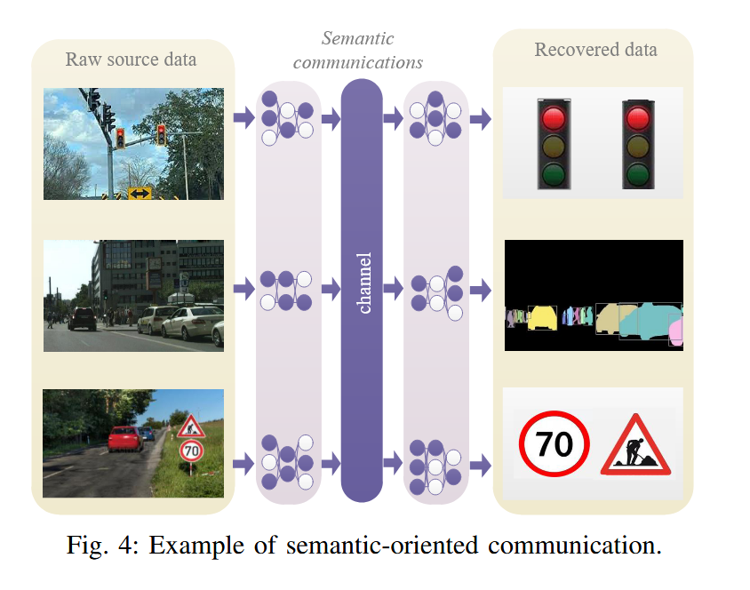

# 语义通信综述

## 介绍语义通信
### 语义通信的含义
在互联网通信过程中识别和利用消息的含义。与传统的面向数据的通信网络相比，其容量的提高是以系统复杂性为代价的，SemCom使所有通信参与者能够通过在接收者或通信任务的目标
之后传输最相关的信息来减轻网络负担。
### 语义通信能解决的问题
1. 减轻6G网络的无线数据传输负担。
2. 提升6G网络控制和管理效率。
3. 利用信息语义设计有效的网络资源分配方案。

## 语义通信基础

<mark>三个沟通层次</mark>
**A级** 通信符号的传输精度如何？ （技术层面。） 
**B级** 传输的符号传达所需含义的精确程度如何？ （语义级别。） 
**C级** 收到的含义如何有效地以期望的方式影响行为？ （有效性水平。）

### SemCom 的三种类型

#### 1.面向语义的通信

传统通信和面向语义的通信的区别

面向语义的通信在编码之前引入了一个**语义表示模块**，负责捕获核心信息，过滤掉不必要的冗余信息
在许多研究中，语义表示和语义编码的功能被集成到一个称为**语义编码**的模块中，共同起到类似于传统通信中的短码来源的作用。

语义推理和语义解码的组合作用相当于源解码的作用。在一般的 SemCom 场景中，解码是编码的逆过程，它基于人工智能技术，例如 Transformer 和自动编码器，这些技术具有强大的先验知识。

在上图中，传统通信方法保留了所有细节，而SemCom可以通过适当的图像处理技术过滤掉不必要的细节从而减轻网络的压力
<u>在SemCom中，通信双方的本地知识需要实时共享，以确保所有源数据的理解和推理过程能够很好地匹配。如果局部知识不匹配，就会产生语义噪声，即使在物理传输过程中没有语法错误，也会导致语义歧义。</u>
#### 2.面向目标的通信
在第一种面向语义的通信中，侧重于关注语义信息，而在面向目标的通信中，更关注**语用信息（pragmatic information**）的捕获