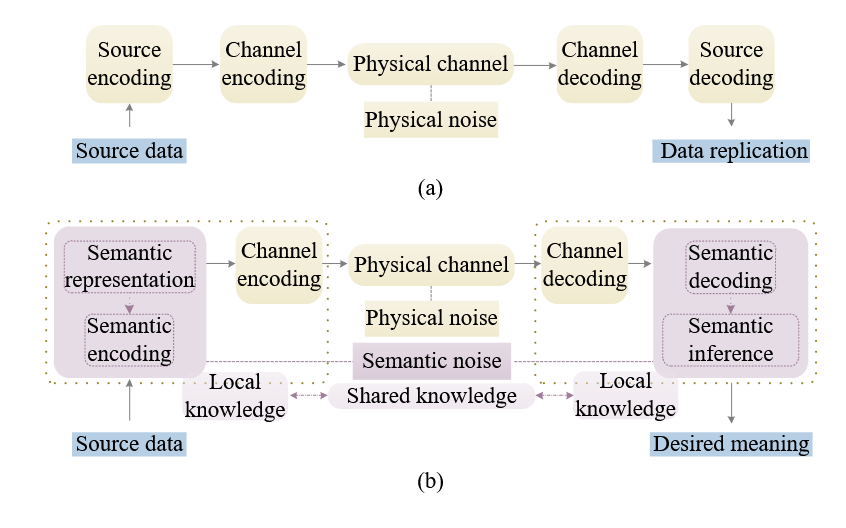

# 语义通信综述

## 介绍语义通信
### 语义通信的含义
在互联网通信过程中识别和利用消息的含义。与传统的面向数据的通信网络相比，其容量的提高是以系统复杂性为代价的，SemCom使所有通信参与者能够通过在接收者或通信任务的目标，之后传输最相关的信息来减轻网络负担。
### 语义通信能解决的问题
1. 减轻6G网络的无线数据传输负担。
2. 提升6G网络控制和管理效率。
3. 利用信息语义设计有效的网络资源分配方案。
   
--- 

## 语义通信基础

<mark>三个沟通层次</mark>
**A级** 通信符号的传输精度如何？ （技术层面。） 
**B级** 传输的符号传达所需含义的精确程度如何？ （语义级别。） 
**C级** 收到的含义如何有效地以期望的方式影响行为？ （有效性水平。）
### SemCom 的三种类型

#### 1.面向语义的通信
>

面向语义的通信在编码之前引入了一个**语义表示模块**，负责捕获核心信息，过滤掉不必要的冗余信息
在许多研究中，语义表示和语义编码的功能被集成到一个称为**语义编码**的模块中，共同起到类似于传统通信中的短码来源的作用。

语义推理和语义解码的组合作用相当于源解码的作用。在一般的 SemCom 场景中，解码是编码的逆过程，它基于人工智能技术，例如 Transformer 和自动编码器，这些技术具有强大的先验知识。
>
在上图中，传统通信方法保留了所有细节，而SemCom可以通过适当的图像处理技术过滤掉不必要的细节从而减轻网络的压力
<u>在SemCom中，通信双方的本地知识需要实时共享，以确保所有源数据的理解和推理过程能够很好地匹配。如果局部知识不匹配，就会产生语义噪声，即使在物理传输过程中没有语法错误，也会导致语义歧义。</u>
#### 2.面向目标的通信

在第一种面向语义的通信中，侧重于关注语义信息，而在面向目标的通信中，更关注**实用信息（pragmatic information）** 的捕获
面向目标的通信和面向语义的通信的不同之处在于沟通的目标也需要在语义通信中发挥作用。以图像传输为例，不同的任务所需的图像的特征（即SI）是不同的。因此，在多任务的传输系统中，在面向目标的通信中，对于某个任务，可能每次只需要传输图像的局部特征。相比之下，在面向语义的通信中，由于是非目标特定的，提取的SI应该包括所有可能任务的特征，这导致传输过程中的信息冗余和资源浪费。
面向目标的通信关注的是有效层面，旨在在有限的网络资源下以期望的方式完成任务，而不是面向语义的通信中关注语义层面的SI准确性。
>与面向语义的通信类似，面向目标的通信各方的局部知识和通信目标需要保持一致，否则产生的语义噪声可能会导致任务失败。

#### 3.语义感知通信（面向任务的通信）
在面向任务的通信中，多个智能体以集中式或分布式的方式协作完成任务，如图3（d）所示。任务中的语义感知通信以主动或被动的方式在不同终端之间建立多个显式或隐式连接，以增强代理之间的知识。这里的SI是通过分析代理行为和当前执行任务的环境来获得的，而不是从数据源中提取。例如，在自动驾驶中，SI可以表示两辆车之间发生碰撞的风险，该风险是由车辆位置和运动学信息、交通密度、道路状况、红绿灯部署等共同确定的。此外，SI还可以描述一系列连续的汽车经过围墙分区的出口时所捕捉到的景色。聚合 SI 后，可以获得细分出口的连续视图的语义表示，这可以促进细分内沿出口车道的出口监控和活动跟踪 。在语义感知通信中，可能没有显式的收发器或完整的成对语义编码和解码过程。因此，目前还没有一个用于语义感知通信的通用系统模型。

---

## 语义提取技术和挑战

### 基于深度学习的语义提取

1. **视觉数据的语义提取**
   - 一种以识别精度为设计指标的DL构建的联合传输识别方案（JTRS）。采用了ResNet架构,ResNet的深度神经网络（DNN）被分为两部分。前几层在发送器处充当特征提取器（即语义提取器），其余层在接收器处充当识别器。此外，为了实现噪声通道中的自适应语义提取，通过使用 DNN 作为通道编码器和解码器来实现联合语义通道编码（JSCC）.由于在调制和传输之前缺乏量化和比特转换过程，JTRS在模拟传输中的运行时间远低于其他方法，这意味着基于DL的SemCom在低延迟通信方面具有先天优势。然而，该方案仅设计用于在**特定信噪比SNR**下运行。当信道条件发生变化时，SE模型需要重新训练或细化，这会带来相当大的额外开销。
  
  >*为了填补 SemCom 和传统通信之间的这一空白,有的研究考虑了一种具有 SNR 反馈的点对点图像传输系统。他们将CV中广泛使用的注意力机制集成到SE中。注意力机制采用额外的神经网络来严格选择某些特征或为原始神经网络中的不同特征分配不同的权重。在他们提出的设计中，联合语义通道编码由单个网络执行，该网络由两个模块组成：特征提取（FE）模块和注意特征（AF）模块。 FE 模块用于从输入图像中学习特征。然后，AF 模块将 FE 模块的输出和 SNR 作为输入，并生成一系列缩放参数。*

>*有的项目主要研究了图像分类对于语义噪声的应用，利用图像数据的大量空间冗余性，他们提出了一种具有非对称编码器的体系结构的资源高效性SE模型。编码器采用了一个掩码自动编码器（MAE）与视觉变压器（ViT）架构。具体而言，在所提出的体系结构中，原始图像的一部分被掩盖，然后将未掩盖部分嵌入其在原始图像中的位置信息，随后提取图像特征。由于编码器只需要处理未被屏蔽的部分，大大减少了内存消耗。相反，解码器的输入是由未掩盖部分和掩盖部分的标记组成的完整集合，需要预测掩盖部分。与之前的SE模型不同的是，该架构中解码器可以独立于编码器进行设计，因为解码器只用于执行图像重建任务，这使得系统设计具有更大的灵活性。同时，MAE还可以抵御恶意攻击者，即通过在图像中添加语义噪声。由于MAE在编码过程中随机掩码图像的部分补丁，可以在一定程度上消除图像补丁中添加的语义噪声的影响。*

2. **文本数据的语义提取**
    受益于机器翻译等NLP中DL成功的启发，有的研究考虑利用SemCom进行文本传输

3. **音频数据的语义提取**
   

4. **多模态数据的语义提取**
   对多模态的研究主要集中在VQA问题上。在VQA任务中，一些用户传输图像，而另一些用户发送文本来询问图像的信息，答案是在接收方那里得到的。

### 基于强化学习的语义提取

由复杂的语义指标指导的学习过程可以促进更准确的SE。然而，其他领域的许多现有语义度量都是无差别的。为了克服深度学习对损失函数可微分的严格要求，强化学习被视为一种有前途的替代方案。

研究中将RL集成到文本传输的端到端SemCom系统中，其中的编码器与解码器可以视为与外部环境（即文本）交互的代理，采用LSTM来提供策略。然而，即时奖励函数形式的确定特别棘手。与大多数基于强化学习的策略在每个时间步都有明确定义的奖励不同，解码过程中的奖励直到句子结束时才能直接测量。

### 知识库辅助的语义提取

直观上，不同的通信目标的语义信息SI可能是不同的，但仍然具有高度相关性。基于 DL 的 SE 模型对相同的原始数据重复执行 SE 可能会导致大量系统冗余。为了解决这个问题，一种合适的方法是提取原始数据传达的所有 SI 单位，并将各个通信目标对应于 SI 单位的不同组合。为此，需要在发送任务请求之前，在发送方和接收方提前建立共享知识库。同时，SE的过程可以被视为细化每个SI单元对个人沟通目标的重要性。

知识库KB是一种已广泛应用于自动化人工智能系统中的技术，用于存储具有形式表示的数据，以进行推理。一般来说，典型的知识库由计算本体、事实、规则和约束组成。特别是对于SemCom系统，知识库应该由SI、通信任务的目标以及所有通信参与者都能理解、识别和学习的可能推理方式组成。具体来说，KB可以用来记录每个SI单元与每个任务之间的关系，并量化SI对于不同任务的重要性程度，从而在通信任务发生变化时指导SE在不同的信道条件下的工作。

